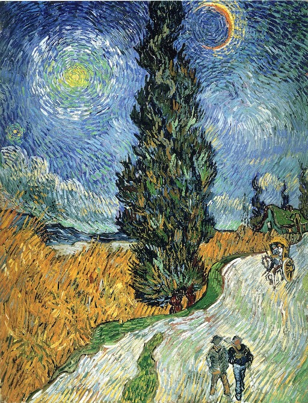
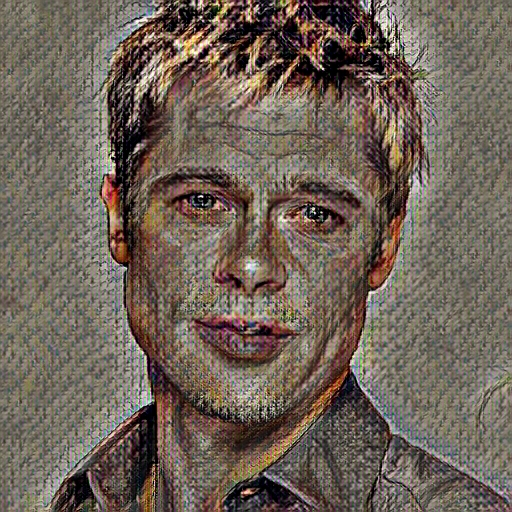
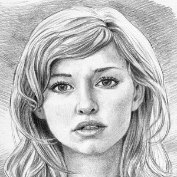
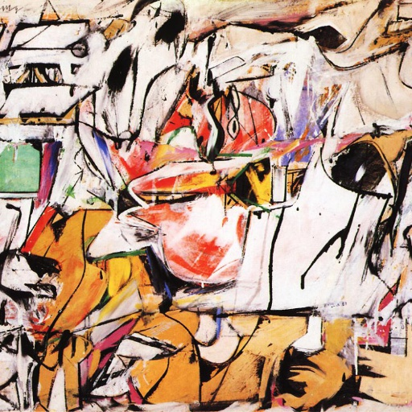
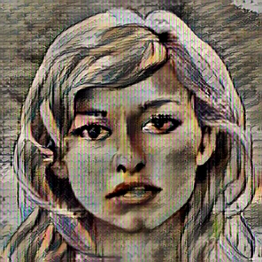

# adain-style-transfer
# DLS 1st semester final project
Цель данного проекта - реализация переноса произвольного стиля с одного изображения на другое

Алгоритм реализован на основании статьи [Arbitrary Style Transfer in Real-time with Adaptive Instance Normalization](https://arxiv.org/abs/1703.06868)

Так же для разбора с малопонятными деталями анализировался код авторов метода из этого [репозитория](https://github.com/xunhuang1995/AdaIN-style)
# Использование готовой модели
```
python -m test.py --content-path <путь к файлу контента> \
    --style-path <путь к файлу стиля> \ 
    --model <путь к модели> \
    --alpha <коэффициент стилизации 0.1-1.0> \
    --no-show-plot
```
Все параметры опциональны, по умолчанию будут выбраны дефолтные тестовые файлы и предобученная модель
## Демо-версия
Доступна здесь: [https://dls-adain.streamlit.app/](https://dls-adain.streamlit.app/)

# Обучение модели
## Подготовка датасета
Для обучения модели необходимы два датасета - датасет стилей и датасет контента. В работе по которой реализовывался проект бралось примерно 80.000 файлов
Файлы предварительно необходимо отмасштабировать до размера минимальной стороны 512 пикселей
```
python -m image_processor.py <source_dir> <target_dir>
```
Команда создаст копию отмасштабированных файлов в target_dir. target_dir не должен существовать для запуска просцесса
## Обучение модели
```
python -m train.py -m --num-epochs <количество эпох> \
    --batch-size <размер батча> \
    --base_lr <learning rate> \
    --style-loss-coeff <Лямбда коэффициент веса лосса стиля при обучении> \
    --checkpoints-dir <путь для сохранения промежуточных данных при обучении> \
    --content-dir <путь к датасету контента> \
    --style-dir <путь к датасету стилей> \
```
# Реализация
## Содержание файлов
| Файл                            | Описание                                                                 |
|---------------------------------|--------------------------------------------------------------------------|
| src/adain.py                    | Реализация AdaIN слоя                                                    |
| src/dataset.py                  | Реализация датасета для обучения                                         |
| src/decoder.py                  | Реализация декодера                                                      |
| src/encoder.py                  | Реализация энкодера                                                      |
| src/image_processor.py          | Скрипт для масштабирования изображений                                   |
| src/model.py                    | Реализация модели                                                        |
| src/style_transfer_loss.py      | Реализация функции потерь                                                |
| src/train.py                    | Код обучения модели                                                      |
| src/transfer_style.py           | Код для запуска переноса стиля с использованием готовой модели           |
| src/utils.py                    | Вспомогательные функции                                                  |
| src/visualize_training_stats.py | Визуализация статистики обучения модели                                  |
| app.py                          | Код для запуска streamlit веб-приложения с использованием готовой модели |
| test.py                         | Код для запуска переноса стиля с использованием готовой модели           |
| train.py                        | Код запуска обучения                                                     |
| demo.ipynb                      | Ноутбук с кодом тренировки модели на малом датасете                      |

## Особенности реализации
Авторы использовали нормализованную версию VGG19, с заменой Zero padding на Reflection padding. В данной реализации использовалась предобученная модель VGG19 из библиотеки torchvision, с заменой Zero padding на Reflection padding
Алгоритм нормализации не был описан, ими была взята за основу уже нормализованная модель
Поэтому в данном проекте vgg19 использовался "из коробки"
Так же авторы в коде указали использование лямбда коэффициента лосса стиля 0.01
Такой коэффициент в данной реализаци приводил к очень незначительному изменению стиля, поэтому был увеличен до 1.0
## Результаты
Примеры некоторых стилизаций
<div align="center">
  
  
  
</div>
<div align="center">
  
  
  
</div>
Видео демонстрация [здесь](demo/demo.mp4)
## Возможные дальнейшие улучшения
1. Попробовать использовать нормализованный vgg19
2. Перейти в тренировочном процессе от эпох к итерациям, как в изначальной статье
3. Оптимизировать learning rate scheduler